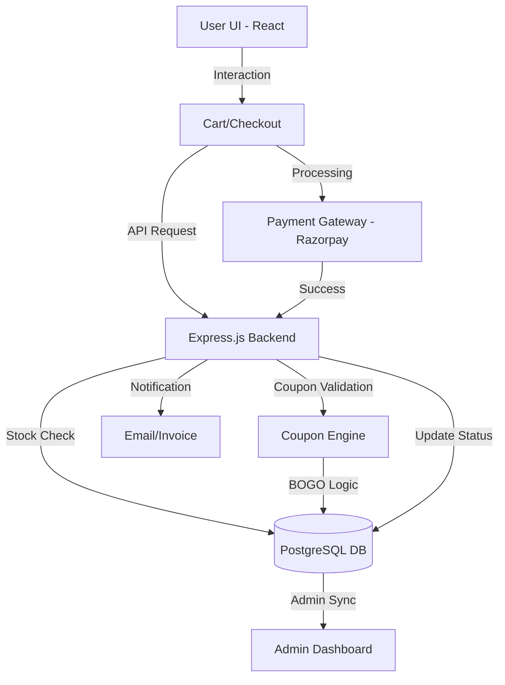

# HOMVED - Backend (medived-api)

## Project Overview
This is the backend API service for **HOMVED**, a comprehensive full-stack e-commerce solution specializing in **herbal and ayurvedic products**. Built with **Node.js** and **Express.js**, it provides a secure and scalable API for e-commerce transactions and data management.

## Technical Stack
- **Runtime:** Node.js
- **Framework:** Express.js
- **Database:** PostgreSQL (hosted on Supabase)
- **Authentication:** Passport.js (Google & Facebook OAuth), JWT, bcryptjs
- **Payments:** Razorpay Integration
- **File Management:** Multer (local/cloud uploads)
- **Document Generation:** Puppeteer-core, Handlebars (for invoices/reports)
- **Analytics:** Google Analytics 4 integration

## System Architecture Flow


## Key Backend Features
- **Security:** CSRF and JWT-based authentication with Passport.js integration.
- **RESTful API:** Structured endpoints for products, orders, coupons, and users.
- **Payment Processing:** Integrated with Razorpay for secure online transactions.
- **Stock Validation:** Real-time stock counts and automatic locking during checkout.
- **Coupon Engine:** Sophisticated logic for Fixed/Percentage and Buy One Get One (BOGO) discounts.
- **Document Generation:** Automated generation of PDF invoices and reports via Puppeteer.

## Setup Instructions
1. **Navigate to the directory:**
   ```bash
   cd medived-api
   ```
2. **Install dependencies:**
   ```bash
   npm install
   ```
3. **Configure Environment:**
   - Create a `.env` file based on `.env.example`.
   - Provide PostgreSQL connection credentials, OAuth keys, and Razorpay API details.
4. **Start Server:**
   - Development Mode: `npm run dev`
   - Production Mode: `npm start`

## Project Team
**Owner:** Vinod Mahajan Sir  
**Manager:** Sagar Mali Sir  
**Developers:**  
1. Aniket Mali  
2. Yogesh Chitrakathi  
3. Kuldeep Mahajan  

**Continuous Maintenance:** Yogesh Chitrakathi

---

## Related Frontend Repository

This repository contains the Backend application.
The frontend services required for this application are maintained in the following repository:

- Frontend Repository: <https://github.com/Devnectar25/reactshop-home>

